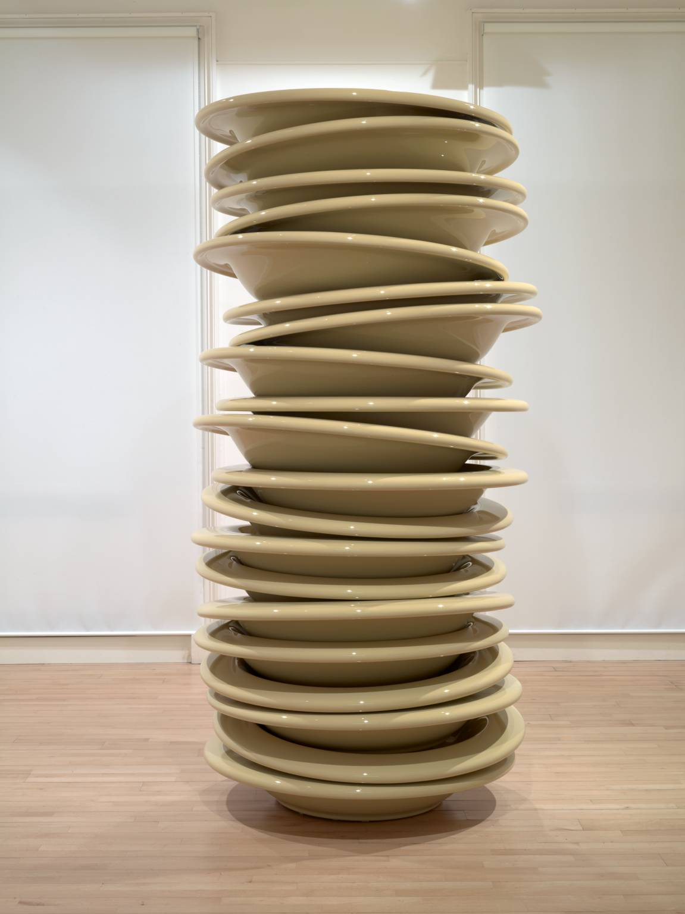

  

# Interrupts <!-- omit in toc -->

## Contents <!-- omit in toc -->

- [Stacks](#stacks)
  - [Push and pop excercise](#push-and-pop-excercise)
    - [Answers](#answers)
  - [What are stacks actually used for?](#what-are-stacks-actually-used-for)
- [Queues](#queues)
  - [Questions](#questions)
    - [Answers](#answers-1)
  - [Where are queues actually used?](#where-are-queues-actually-used)

## Stacks

Stacks work on the "last in, first out" system (LIFO): the last item to be put into a stack is the first item to be popped out.

With a stack, you can **only** access the first item (at the top). Think about a stack of plates: you wouldn't take a plate from the middle of a stack, you'd take it from the top.

Adding an item to a stack is called **pushing** it onto the stack. Removing an item from a stack is called **popping**.

Stacks are allocated memory dynamically: the grow and shrink as needed.

> 
>
> A stack of plates!

\*Please remember that the idea of a "stack" of items on top of each other is a way for humans to think of it. It's not stored like this in memory, but is instead programmed to behave like this.

### Push and pop excercise

**Create a stack capable of holding 6 integers.**

1. Push 5, push 3, push 4, pop, push 2, pop, pop, push 1
2. Push 1, push 2, push 3, push 4, push 5, pop, pop, pop, pop, pop
3. Push 7, push 3, pop, pop, push 1, pop, push 7, push 8, push 9, push 11, push 12, push 8, pop

#### Answers

1. `1`
2. None - it's empty
3. `12`

**Cheeky trick** - you don't need to look at the whole stack. Instead, you can work your way backwards. For 1, it ends with a push of `1`, so you can be sure `1` will be at the top of the stack.

For 2, you can count the pops going backwards, then ignore that amount of pushes. There are 5 pops, so we ignore 5 pushes. We're left with nothing.

For 3, we pop once, so we go backwards and ignore the first push, so we finish with the 2nd to last push, which is `12`.

### What are stacks actually used for?

A great example of where stacks are used is during interrupts. Before an Interrupt Service Routine (ISR) is run, the CPU will **push** the values from all the CPU registers into a stack. Once this ISR is complete, the values are **popped** off to continue execution where it left off.

Another place that stacks are used is programming. When you call a function, the address you were running instructions is pushed onto a stack so that the program knows where to continue execution when the called function finishes.

## Queues

Queues work via a "first-in first-out" (FIFO) or "last-in last-out" (LILO) system: the first item added will be the first item removed.

We use the same words **push** and **pop** to describe the adding and removing of data, but we also use **enqueue** and **dequeue**.

Both the front (head) and end (tail) of the queue is visible at all times.

Queues are also dynamic: they grow and shrink in size as items are added and removed.

### Questions

Set up a queue which holds 5 integers. What values are left in the queue and what are the items that have been removed.

1. E5, E7, E10, D, D, E1, D
2. E1, E2, E3, E4, E5, D, D, D, D, D
3. E3, E8, E9, D, E7, E2, E12, E1, D

#### Answers

1. In queue: `1`. Removed: `5`, `7`, `10`
2. In queue: none. Removed: `1`, `2`, `3`, `4`, `5`
3. In queue: `9`, `7`, `2`, `12`. Removed: `3`, `ERROR: FULL`, `8`

### Where are queues actually used?

Printers! When we queue something for printing, jobs are completed in the order they are sent. Otherwise it would be a little unfair to the poor person waiting for their print job.

Media streaming. When you watch video, the stream is played in the order the chunks are received. You wouldn't want it skipping ahead, then playing backwards.
