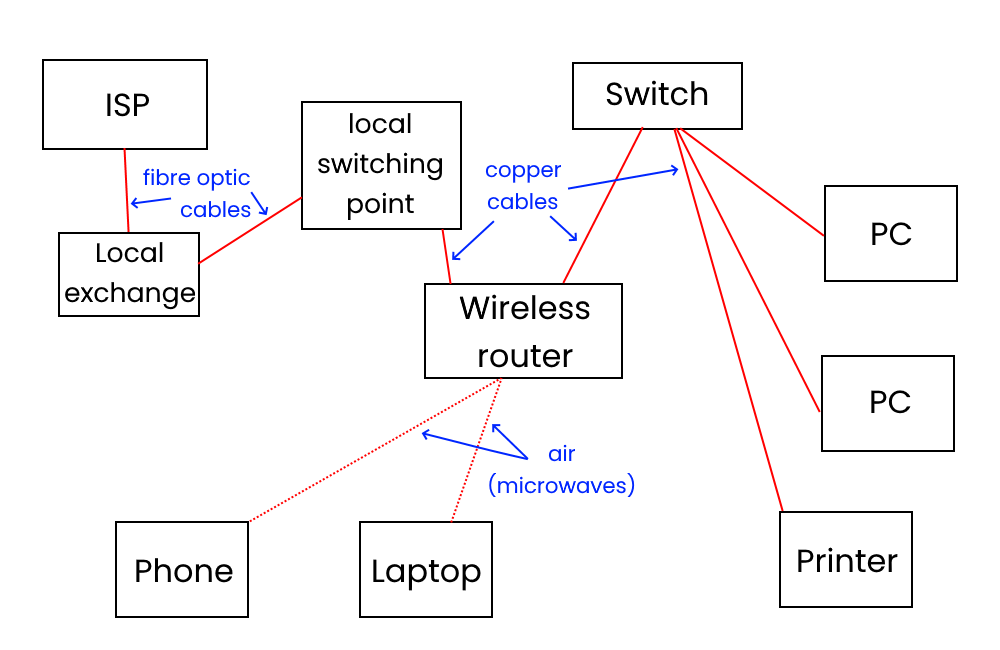

  

<!-- omit in toc -->

# Data transmission <!-- omit in toc -->

## Contents <!-- omit in toc -->

- [Communication channels](#communication-channels)
- [Types of network](#types-of-network)
  - [LAN](#lan)
    - [Benefits of LANs](#benefits-of-lans)
    - [Disadvantages of LANs](#disadvantages-of-lans)
  - [WAN](#wan)
    - [How we connect LANs](#how-we-connect-lans)
    - [Advantages of WANs](#advantages-of-wans)
    - [Disadvantages of WANs](#disadvantages-of-wans)
- [Typical home/organisation network](#typical-homeorganisation-network)
- [Wireless communication methods](#wireless-communication-methods)

## Communication channels

| Type of channel    | Key features                                                | Advantages                                                                                  | Disadvantages                                                                                          | Example uses                                       |
| ------------------ | ----------------------------------------------------------- | ------------------------------------------------------------------------------------------- | ------------------------------------------------------------------------------------------------------ | -------------------------------------------------- |
| **Simplex**        | One way communication only                                  | No possible traffic issues                                                                  | No bi-directional communication is possible                                                            | Mobile network Emergency Alerts                    |
| **Half duplex**    | Two way communication, but not simultaneously               | Allows for two-way communication                                                            | Can only send data after finished receiving - increased latency. Risk of data clash.              | Walkie talkies - only one person can speak at once |
| **Full duplex**    | Two-way communication simultaneously                        | Allows for bi-directional communication without waiting                                     | More expensive to operate -- might need 2 sets of cables, or 2 frequencies to broadcast and receive on | DOCSIS Co-axial or modern broadband                |
| **Point to point** | A direct connection between two devices                     | Allows a simple connection method between two devices for simple networking                 | Requires multiple hops between each device on a point to point network if used in a large organisation | Bluetooth                                          |
| **Multi-drop**     | A communication channel from one device to multiple others. | More efficient to set up (easier to broadcast info than to specifically send to one device) | All devices receive the data, creating security risks                                                  | Wireless network communication (4G, WiFi)          |

## Types of network

There are two main types of network: a WAN (wide area network) and a LAN (local area network).

### LAN

A local area network is a connected system of nodes (computers, switches, routers, servers) in a limited geographical area (a building, a room, etc).

For it to be a LAN, all nodes, cables, etc must be owned by or the responsibility of the organisation. For example, in a school or college, the Ethernet cables, computers, servers are all owned by or leased by the organisation.

#### Benefits of LANs

- Resources and files can be shared between users of the LAN
- Users can often log into other computers on the network using a Roaming Profile
- Peripherals, such as printers, can be shared by users on the LAN
- Backups can be made centrally
- Software can be installed centrally

#### Disadvantages of LANs

- Possibility of network failure
- The cost is quite high due to cabling, software, Active Directory servers, etc.
- Support staff are needed to maintain the network
- Viruses and malware can spread more easily

### WAN

A WAN connects two or more LANs together, such as two company or building LANs, or a split student and teacher LAN.

A company WAN will allow different offices to share files and resources stored on each of their networks.

The largest WAN in existence is the Internet: this connects **billions** of LANs (home networks, schools, offices, and more) all connected into one single diverse network.

#### How we connect LANs

There are several ways that we can connect different LANs together. Some of the more common methods are:

- fibre optic cables
- leased telephone lines (similar to dial-up internet)
- satellite communication links
- microwave links

#### Advantages of WANs

- Allow networks outside of your LAN to connect together and share information
- Allow collaboration between many different geographical areas

#### Disadvantages of WANs

- cost
  - you need to pay for a WAN (e.g. broadband internet connection)
- network failure
  - sometimes cables break, or servers have hardware failures
  - results in loss of productivity
  - you can't always fix the issue if it's outside of your organisation's remit, so you need to wait for the WAN organisation to fix it

## Typical home/organisation network

> 
>
> A diagram showing a "standard" home/small business network

## Wireless communication methods

Wireless means no wires!

**WiFi**

- Normally used to connect laptops/phones/PCs to a LAN

**Bluetooth**

- For short-distance communication
- Often used in low-power devices
  - Mice and keyboards
  - Wearables
  - Headphones

**Mobile network infrastructure (UMTS/HSDPA/LTE)**

- For longer distance
- Requires authentication, usually provided via a SIM or eSIM
- Provided via microwaves at varying frequencies (lower freqs travel further)
