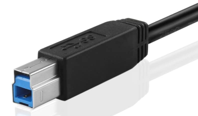

  

<!-- omit in toc -->

# Data transmission <!-- omit in toc -->

## Contents <!-- omit in toc -->

- [Communication channels](#communication-channels)
- [Types of transmission](#types-of-transmission)
  - [Synchronous transmission](#synchronous-transmission)
  - [Asynchronous transmission](#asynchronous-transmission)
  - [Comparison table](#comparison-table)
- [Types of network](#types-of-network)
  - [LAN](#lan)
    - [Benefits of LANs](#benefits-of-lans)
    - [Disadvantages of LANs](#disadvantages-of-lans)
  - [WAN](#wan)
    - [How we connect LANs](#how-we-connect-lans)
    - [Advantages of WANs](#advantages-of-wans)
    - [Disadvantages of WANs](#disadvantages-of-wans)
- [Typical home/organisation network](#typical-homeorganisation-network)
- [Wired communication methods](#wired-communication-methods)
- [Wireless communication methods](#wireless-communication-methods)
- [Data packets](#data-packets)
  - [Packet headers](#packet-headers)
  - [Packet footer](#packet-footer)
- [Packet switching](#packet-switching)
- [Transmission protocols](#transmission-protocols)

## Communication channels

| Type of channel    | Key features                                                | Advantages                                                                                  | Disadvantages                                                                                          | Example uses                                       |
| ------------------ | ----------------------------------------------------------- | ------------------------------------------------------------------------------------------- | ------------------------------------------------------------------------------------------------------ | -------------------------------------------------- |
| **Simplex**        | One way communication only                                  | No possible traffic issues                                                                  | No bi-directional communication is possible                                                            | Mobile network Emergency Alerts                    |
| **Half duplex**    | Two way communication, but not simultaneously               | Allows for two-way communication                                                            | Can only send data after finished receiving - increased latency. Risk of data clash.              | Walkie talkies - only one person can speak at once |
| **Full duplex**    | Two-way communication simultaneously                        | Allows for bi-directional communication without waiting                                     | More expensive to operate -- might need 2 sets of cables, or 2 frequencies to broadcast and receive on | DOCSIS Co-axial or modern broadband                |
| **Point to point** | A direct connection between two devices                     | Allows a simple connection method between two devices for simple networking                 | Requires multiple hops between each device on a point to point network if used in a large organisation | Bluetooth                                          |
| **Multi-drop**     | A communication channel from one device to multiple others. | More efficient to set up (easier to broadcast info than to specifically send to one device) | All devices receive the data, creating security risks                                                  | Wireless network communication (4G, WiFi)          |

## Types of transmission

### Synchronous transmission

- Data is sent in a continuous stream with no gaps in between data
- Timing signals are generated by an internal clock to synchronise the sending and receiving of data between devices
- Generally faster than asynchronous
- Devices can become ‘out of sync’ over time and data can collide, causing errors in transmission

### Asynchronous transmission

- Data is sent in small bundles called packets
- Packets have start and end bits to indicate when a device is finished sending a packet
- No need to synchronise devices
- Slower than synchronous, but less chance of errors

### Comparison table

|                           | Advantages                                                            | Disadvantages                                                | Real-world use case(s)                                                                   |
| ------------------------- | --------------------------------------------------------------------- | ------------------------------------------------------------ | ---------------------------------------------------------------------------------------- |
| Asynchronous transmission | Less prone to corruption/errors Easy to resend lost pieces of data | Slower Requires more processing (need to reassemble)      | For scenarios where efficiency, routing, and error correction is key (e.g. web browsing) |
| Synchronous transmission  | Faster Doesn't suffer from collisions as often                     | If data is corrupted or lost, all of the data must be resent | To send large amounts of data from one location to another quickly                       |

## Types of network

There are two main types of network: a WAN (wide area network) and a LAN (local area network).

### LAN

A local area network is a connected system of nodes (computers, switches, routers, servers) in a limited geographical area (a building, a room, etc).

For it to be a LAN, all nodes, cables, etc must be owned by or the responsibility of the organisation. For example, in a school or college, the Ethernet cables, computers, servers are all owned by or leased by the organisation.

#### Benefits of LANs

- Resources and files can be shared between users of the LAN
- Users can often log into other computers on the network using a Roaming Profile
- Peripherals, such as printers, can be shared by users on the LAN
- Backups can be made centrally
- Software can be installed centrally

#### Disadvantages of LANs

- Possibility of network failure
- The cost is quite high due to cabling, software, Active Directory servers, etc.
- Support staff are needed to maintain the network
- Viruses and malware can spread more easily

### WAN

A WAN connects two or more LANs together, such as two company or building LANs, or a split student and teacher LAN.

A company WAN will allow different offices to share files and resources stored on each of their networks.

The largest WAN in existence is the Internet: this connects **billions** of LANs (home networks, schools, offices, and more) all connected into one single diverse network.

#### How we connect LANs

There are several ways that we can connect different LANs together. Some of the more common methods are:

- fibre optic cables
- leased telephone lines (similar to dial-up internet)
- satellite communication links
- microwave links

#### Advantages of WANs

- Allow networks outside of your LAN to connect together and share information
- Allow collaboration between many different geographical areas

#### Disadvantages of WANs

- cost
  - you need to pay for a WAN (e.g. broadband internet connection)
- network failure
  - sometimes cables break, or servers have hardware failures
  - results in loss of productivity
  - you can't always fix the issue if it's outside of your organisation's remit, so you need to wait for the WAN organisation to fix it

## Typical home/organisation network

> 
>
> _A diagram showing a "standard" home/small business network_

## Wired communication methods

**USB 2.0**

- Used in older devices
- Being phased out on high-bandwidth devices (e.g. USB flash drives) in favour of USB 3+
- Often used for peripheral devices (mice, keyboards, printers), and for power transfer
- Very widespread and cheap

**USB 3.0**

- Used in newer devices
- Supports high speed data transfer
- Common in flash drives and external hard drives where speed is key
- Widespead and cheap
- Easy to damage

**USB Type B**

- Usually used in secondary ("slave") devices (devices which are controlled by another, e.g. a printer)
- Uses standard USB protocols: it's just a different connector
- Not very common anymore: tends to be replace with USB Type Micro B or, more recently, USB Type C

**USB C**

- device agnostic (used on primary and secondary devices)
- supports very high data transfer speed
- supports power delivery (can be used to charge laptops)
- not a protocol in itself: it is just a connector
- supports multiple connection protocols, including
  - USB 1, 2, 3, and 4
  - Thunderbolt 3
  - DisplayPort
  - HDMI
- durable
- becoming cheaper and more widespread
- reversible (better user experience)

**Thunderbolt**

- band name of a transfer protocol designed by Intel
- now being opened to other manufacturers (USB 4)
- supports multiple protocols inside it (DisplayPort, Ethernet)
- multiple different connectors used with the protocol (e.g. USB C)

**Ethernet**

- most commonly used for network connections
- supports high speeds (up to 1 Gbps is common, 10 Gbps is usually just for enterprises)
- cheap to produce and use
- on almost all devices, requiring little or no special hardware

**Fibre optic**

- works by sending signals as streams of light
- can be used with almost any protocol
- common for very high speed and low latency networking
- data transfer is almost instant
- fragile and expensive

**HDMI**

- used to transfer video and audio digitally
- allows for DRM protection such as HDCP
- lossless
- has issues over longer distances (e.g. 35m+)
- supports very high reoslutions (4K at 60 Hz)

**DVI**

- older standard
- can transfer analog or digital video
- does not support audio transfer
- large, bulky (40mm connector vs 21mm for HDMI)
- no DRM/security protection (e.g. no HDCP)
- doesn't support higher resolutions (1920x1200 @ 60 Hz max)

## Wireless communication methods

Wireless means no wires!

**WiFi**

- Normally used to connect laptops/phones/PCs to a LAN

**Bluetooth**

- For short-distance communication
- Often used in low-power devices
  - Mice and keyboards
  - Wearables
  - Headphones

**Mobile network infrastructure (UMTS/HSDPA/LTE)**

- For longer distance
- Requires authentication, usually provided via a SIM or eSIM
- Provided via microwaves at varying frequencies (lower freqs travel further)

## Data packets

Packets are small capsules of information

They're made up of 3 parts:

- Header
  - Information about where the packet is going to and from
- Payload
  - The actual data
- Trailer/Footer
  - Shows the end of the packet
  - Contains information for error checking

> 
>
> _General example of a packet._

### Packet headers

Contains...

- Sender's IP address
  - shows where the packet is coming from
  - ensures the recipient knows where to send responses and requests for more packets to
- Recipient's IP address
  - shows where the packet is going to
  - allows routers to forward the packets correctly
- Protocol
  - shows what protocol the packet belongs to (TCP, UDP)
  - ensures the recipient device knows what type of packet this is
- Packet number
  - used to reassemble data after all packets are received

### Packet footer

- data to indicate the end of the packet

## Packet switching

We break large amounts of data into smaller pieces of data as it's more likely to be lost, slowed down, or corrupted.

Using packets means that, if a packet gets lost or corrupted, we can ask for it to be resent and only a small amount of data needs to be received, rather than the full file.

Packets are sent independently over the network by whatever route is fastest for that packet. This can causing packets to be received in a different order, requiring them to be reconstructed into the original data at the recipient's device.

Sending packets over different routes is called **packet switching**.

## Transmission protocols

A protocol is a set of rules which determine how data is sent over a network between computers.

Before devices communicate, they need to agree on the protocols they will use to communicate, called **handshaking**.

During a handshake the computers decide...

- maximum transfer rate (e.g. 40 Mbps)
- synchronous or asynchronous
- half duplex or duplex
- data coding (e.g. ASCII, UTF-8)
- error correction/handling (e.g. checksums, parity)
- any compression (e.g. gzip, brotli)
