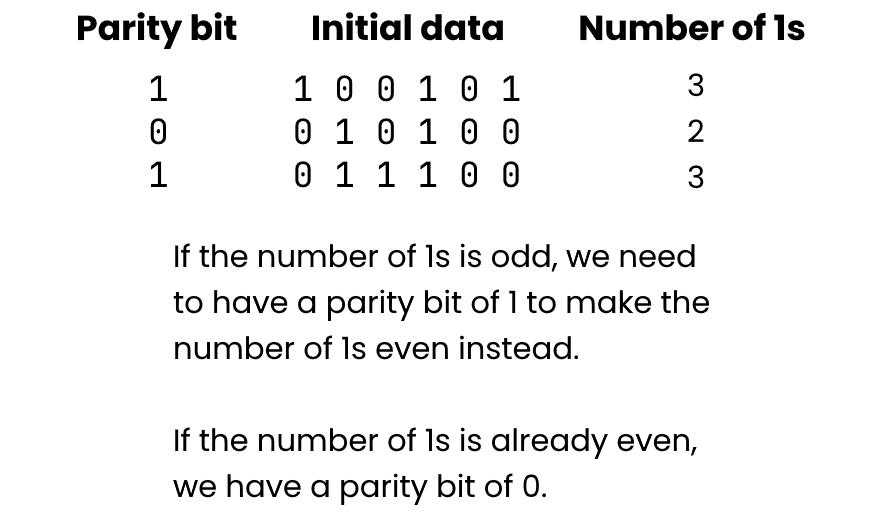

  

# Error detection and correction <!-- omit in toc -->

## Contents <!-- omit in toc -->

- [Why errors happen](#why-errors-happen)
- [Error detection methods](#error-detection-methods)
  - [Repetition](#repetition)
    - [Pros](#pros)
    - [Cons](#cons)
  - [Parity scheme](#parity-scheme)
    - [Example of even parity](#example-of-even-parity)
  - [Check digits](#check-digits)
  - [Checksum](#checksum)
    - [Pros](#pros-1)
    - [Cons](#cons-1)
  - [Cyclic redundancy check (CRC)](#cyclic-redundancy-check-crc)
    - [Pros](#pros-2)
    - [Cons](#cons-2)
  - [Overall implications of error detection](#overall-implications-of-error-detection)
- [Error correction](#error-correction)
  - [Automatic repeat requests (ARQ)](#automatic-repeat-requests-arq)
    - [Implications](#implications)
    - [Variants](#variants)
      - [Stop-and-wait ARQ](#stop-and-wait-arq)
        - [Implications](#implications-1)
      - [Go-back-n ARQ](#go-back-n-arq)
        - [Implications](#implications-2)
      - [Selected repeat ARQ](#selected-repeat-arq)
        - [Implications](#implications-3)
  - [Forward Error Correction (FEC)](#forward-error-correction-fec)
    - [Uses of FEC](#uses-of-fec)
    - [Implications](#implications-4)

## Why errors happen

Communication channels are often "noisy", meaning data can sometimes get altered (corrupted) during transmission. These errors happen when other signals interfere with your data transmission and cause some or all of the data to not be received, or to be changed.

Error detection and correction attempts to detect this corruption and fix it silently without the user even knowing.

Whenever any data is transmitted, there is a risk of corruption. Error detection is built into computer systems and protocols to attempt to eliminate these issues.

These detection algorithms usually involve adding another piece of data to the end of the payload. This data is recalculated at the other end and compared to the value transmitted.

## Error detection methods

- Repetition schemes
- Parity schemes
- Check digits
- CRC

### Repetition

This is the simplest form of error detection.

When you send data, it is repeated an agreed number of times. For example, if you were sending `1010`, your device might actually send `1010 1010 1010`.

When the data is received, the device checks all the repeated data to see if it matches. If it doesn't the assumption is that the data was corrupted, so your device asks for it to be resent.

> **Note:** sometimes the algorithm operates in a majority mode where it will assume the value which is found the most. E.g. `1010 1001 1001` would be assumed to be `1001`.

This algorithm will not always detect every error: there is a chance that all the data could be corrupted or altered in the same
way. This method is also wasteful as the entire data must be repeated multiple times.

#### Pros

- very easy to implement
- useful for communication over very noisy transmission channels

#### Cons

- isn't very effective at catching errors
- repeating more times increases the chance of detecting errors, but becomes extremely wasteful
- susceptible to problems if the same issue happens in the same place for the transmissions
- can be inaccurate if using the majority decision method

### Parity scheme

Another simple form of error detection.

Instead of repeating the entire piece of data, we just add another bit to check if the rest of the data is likely to be correct. This is more commonly used within components of a computer, such as when copying to/from RAM or cache.

Even parity works by counting the number of 1 bits in a word (group of bits). If it's an odd number, we add a parity bit of `1` to make the number of `1`s even. Otherwise we keep it as a `0`.

#### Example of even parity

### Check digits

Check digits are commonly used in barcodes.

For example, an ISBN barcode consist of 12 digits for data, and an additional check digit. The check digit is calculated from the data digits. The scanner can recalculate this bit to check if the barcode scanned correctly.

### Checksum

Checksums are more generalised versions of check digits. They are often used for transmitting files from one location to another.

The checksum algorithm is run on the file data, which then produces a value called the "checksum".

The file can be transmitted and run through the same algorithm by the recipient, then the checksums can be compared.

A change in even one bit in a series of binary data can change the entire checksum.

Common algorithms include:

- MD5 (now broken)
- SHA1 (now broken)
- SHA256
- SHA512

#### Pros

- very reliable method of error checking
  - even the smallest change in data will create a different hash

#### Cons

- algorithms have flaws which allow multiple files to produce the same hash (e.g. MD5 or SHA-1)
  - newer algorithms have longer checksums to reduce this likelihood
- fairly processor intensive and slow for large files

### Cyclic redundancy check (CRC)

A form of checksum calculated before transmission, and placed at the end of a data packet. It can also be used for checking for data corruption when storing files to disk, or for validating firmware versions during updates.

The algorithm applied to the data depends on cyclic codes. The whole packet is treated as a number and is divided by a specific value. The remainder of this calculation is used as the CRC.

The calculation gets repeated on the recipient's end and if they don't match, an error has occurred.

CRCs are redundant meaning that they don't add anything to or change the data itself.

#### Pros

- quite easy to implement in computers
- good at detecting errors

#### Cons

- not good for intentional attacks
  - the CRC could be recalculated by a malicious party

### Overall implications of error detection

- It creates a processing overhead (extra computation required as well as sending the data)
- Decreases the _real_ data transmission rate (extra data must be sent which isn't actually what is needed)
- Reduces overall efficiency
- Impossible to find all errors as separate corruptions could "correct" an error

## Error correction

Error correction is used to recover data after an error is detected through error detection.

Error correction algorithms fall into two categories:

- retransmit the data if an error is detected
  - Automatic repeat requests (ARQ)
- ways to fix the errors without retransmitting
  - Forward error correction (FEC)

### Automatic repeat requests (ARQ)

If a packet is received and an error is detected, it will be retransmitted.

A retransmission can be triggered by one of two things:

- an acknowledgment of an error in a packet is sent (NACK), or
- no acknowledgment of the packet (ACK) is received within a specified time period

#### Implications

- ARQ is used for TCP requests over the internet
- ARQ has delays while waiting for timeouts
- Requires a two-way communication channel
- Buffers to hold received packets while waiting for the rest/retransmitted ones

#### Variants

Three variants of ARQ exist:

- stop-and-wait ARQ
- go-back-n ARQ
- selective repeat ARQ

##### Stop-and-wait ARQ

1. **SENDER:** transmits a packet
2. **SENDER:** waits a specified time (a timeout)
3. **RECEIVER:** if a packet is successfully received, send an ACK message; if an error is detected, discard packet
4. **SENDER:** if no ACK received, retransmit packet; if ACK received, send next packet

###### Implications

- slow
  - only one packet can be sent at a time
- each packet is sent in order
  - if one packet fails to be received multiple times, the other packets are never received

##### Go-back-n ARQ

1. **SENDER:** sends all packets, with packet numbers, without waiting for ACK
2. **RECEIVER:** if packet with error is received, it will send an ACK with the latest successful packet number
3. **RECEIVER:** discard damaged packets
4. **SENDER:** looks at ACKs and resends all packets with packet numbers above the last ACK received

###### Implications

- requires two-way communication
- faster than stop-and-wait
  - all packets are sent without waiting for ACKs

##### Selected repeat ARQ

1. **SENDER:** sends all packets, with packet numbers, without waiting for ACK
2. **RECEIVER:** sends ACK for every packet it successfully receives (with packet number)
3. **RECEIVER:** discards damaged packets
4. **SENDER:** looks at ACKs and resends all packets where ACK has not been received
5. **RECEIVER:** uses packet numbers to rebuild the data from all the packets

###### Implications

- requires two-way communication
- requires a buffer to store all packets
- only missing/damaged packets are re-sent

### Forward Error Correction (FEC)

- an error correction code (ECC) is sent within the frame
- when the frame is received, the ECC is analysed to detect errors and make corrections
- bad data is automatically rebuilt
- ECC is removed before data is rebuilt

#### Uses of FEC

- where transmissions are vulnerable to corruption
- where retransmission would result in limited transfer speeds
  - e.g. WiFi, mobile data, satellites
- where stability and reliability is critical
  - e.g. server ECC RAM

#### Implications

- redundant data is sent
- no retransmission required
- sophisticated techniques (incl. repetition and parity) is used
