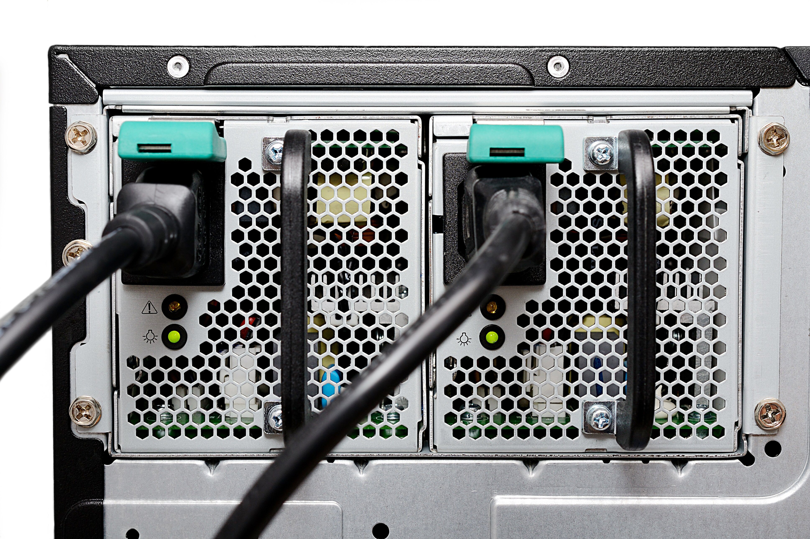

  

<!-- omit in toc -->

# Features and implications of different microarchitectures <!-- omit in toc -->

## Contents <!-- omit in toc -->

- [Features and implications of different microarchitectures](#features-and-implications-of-different-microarchitectures)
  - [Embedded & mobile CPUs](#embedded--mobile-cpus)
    - [System-on-a-chip](#system-on-a-chip)
    - [Mobile CPUs & RISC](#mobile-cpus--risc)
      - [Task](#task)
  - [Microcomputer CPUs](#microcomputer-cpus)
    - [Pros and cons](#pros-and-cons)
    - [Microcomputer CPUs and CISC](#microcomputer-cpus-and-cisc)
    - [Task](#task-1)
  - [Server CPUs](#server-cpus)
    - [Comparison to microcomputers](#comparison-to-microcomputers)
    - [Pros and cons](#pros-and-cons-1)
- [Server CPU vs Desktop CPU vs Mobile CPU](#server-cpu-vs-desktop-cpu-vs-mobile-cpu)

## Embedded & mobile CPUs

Embedded devices are the computers in your appliances, such as washing machines, ovens, and fridges. They often use similar architectures to mobile devices, like phones and tablets.

Compared to microcomputers (PCs)...

- they have slower clock speeds
- they have fewer cores

### System-on-a-chip

These computers tend to use a system-on-a-chip (SoC), meaning all the main components of the computer (CPU, RAM, GPU, storage) are on a single silicon ship, which is, about the same size of a normal desktop CPU.

> 
>
> _An example of a system-on-a-chip: the Samsung Galaxy S4._

SoCs tend to require far less power to perform their functions. This is important, as mobile devices need to run off of batteries. They also produce far less heat, meaning they can normally be passively cooled (cooled without fans).

### Mobile CPUs & RISC

Mobile CPUs tend to use the ARM instruction set, which is a [RISC-based](Instruction%20sets.md#risc-and-cisc) instruction set.

| Pros                                                                        | Cons                                                                                     |
| --------------------------------------------------------------------------- | ---------------------------------------------------------------------------------------- |
| Need fewer transistors to execute instructions, so the CPUs can be smaller. | Increased number of instructions needed for the same process, meaning more RAM needed.   |
|                                                                             | ARM CPUs are compatible with [pipelining](Parallel%20processing.md#method-1-pipelining). |

#### Task

> The main goals of a mobile CPU are to save physical space, reduce power consumption, and reduce heat.
>
> Write an explanation in your own words about how it achieves each of these goals.

- Mobile CPUs use ARM, which is a RISC-based instruction set.
- RISC instruction sets execute simpler instructions, meaning fewer transistors are needed.
  - fewer transistors means that the CPU takes up less space.
- RISC instructions require less energy as they need fewer transistors and take less time to run.
- Mobile CPUs also have smaller transistors, meaning that they use less power.
- As the CPU uses less power, less energy is lost as heat, allowing it to run cooler.

## Microcomputer CPUs

A microcomputer refers to desktop PCs and laptops. They are called microcomputers as, when they were created, the only people who had computers were large organisations, which took up a whole room. This is less of the case now.

The main differences between microcomputers and mobile/embedded systems are:

- the CPU is its own silicon chip on its own
- the CPU is connected to a motherboard, either via a soldered connection, or a socket
- CPU is much larger

> 
>
> _An image of a modern Intel Coffee Lake CPU._

### Pros and cons

| Pros                                                                   | Cons                                                           |
| ---------------------------------------------------------------------- | -------------------------------------------------------------- |
| More powerful (as it's bigger, it can have more cores and transistors) | Often more expensive to produce and buy                        |
| Easily upgradable in most cases                                        | Produce more heat, requiring active cooling (cooled with fans) |
| More support for different operating systems and programs              | Much larger than an SoC                                        |

### Microcomputer CPUs and CISC

Most desktop and laptop CPUs use the x86 or x86-64 instruction set, which is a RISC instruction set.

This means that:

- you need to access RAM less often
- reduces the amount of time the CPU is 'fetching'

However, it also means that:

- they need more transistors to be able to process the complex instructions
- which makes them physically larger
- as the instructions may take multiple cycles to complete, they cannot use pipelining

### Task

> Some laptops are beginning to use ARM processors. Why is this?
>
> Write a short explanation.

Apple's Mac product range is transitioning from x86-64 CPUs to ARM CPUs. There are many reasons for this.

The ARM processors will be:

- smaller
- cooler (produce less heat)
  - meaning the computers can be quieter as fans may not be needed
- ARM CPUs have smaller transistors (as small as 5 nanometres)
  - this allows more transistors to fit in the same size as a modern desktop CPU
  - allowing them to add more cores, or reduce physical size
- they are just as fast, or faster, than modern desktop CPUs
- they draw less power
  - meaning their batteries can last for a much longer time
- more modern and efficient processes exist on ARM (such as pipelining)
  - this is due to the fact that they are more modern, so don't need to be backwards compatible with older x86 CPUs
- relatively cheap to produce compared to microcomputer CPUs

## Server CPUs

These are quite different to microcomputer CPUs. The priority for servers is that they are fast, reliable, and **stable**.

Servers almost always have hardware redundancy, such as dual power supplies (in case one fails), huge amount of RAM, very fast and redundant storage, and a CPU with many cores.

The reason for this is to deal with large surges in requests, and to prevent the server failing.

Servers are designed to never switch off, meaning their components are rated and tested for 24/7 operation for long periods of time. If a power supply fails, instead of turning off, the server switches to the other.

If an organisation's server fails, it can cost them a lot of money and time.

> 
>
> _An exmaple of a server's redundant power supplies._

### Comparison to microcomputers

Server CPU architecture is very similar to microcomputer architecture:

- both are normally separate from the motherboard and other components
- both normally use the x86/x86-64 instruction set
- both have the same pros/cons of CISC instruction sets

However, there are some differences:

- server CPUs cannot normally be overclocked
  - this is because servers are meant to be reliable and perform consistently
- server CPUs tend to have many more cores
  - cores are very useful in multithreading
  - this is important when handling many requests from many different users simultaneously
- servers have additional support for reliability technology
  - e.g. ECC (error correcting) RAM which detects and corrects common data corruption issues
- server CPUs tend to have about twice as much cache as desktop/laptop CPUs
  - this is needed due to the many extra cores
  - reduces the time that the CPUs spend fetching data and instructions

### Pros and cons

| Pros                                    | Cons                                                                  |
| --------------------------------------- | --------------------------------------------------------------------- |
| much greater durability and reliability | far more expensive, compared to desktop/laptops                       |
| use better quality components           | suffer from same downsides of CISC instruction sets as microcomputers |

# Server CPU vs Desktop CPU vs Mobile CPU

|                       |        Server CPU         |       Desktop CPU       |                  Mobile CPU                  |
| --------------------- | :-----------------------: | :---------------------: | :------------------------------------------: |
| Name                  |  AMD Threadripper 3990X   |     AMD Ryzen 3700X     |               Snapdragon 865+                |
| Cores                 |            64             |            8            |                      8                       |
| Threads               |            128            |           16            |                      8                       |
| TDP (heat output)     |           280W            |           65W           |                      5W                      |
| Clock Speed           |          2.9 GHz          |         3.6 GHz         | 1 x 3.1 GHz 3 x 2.42 GHz 4 x 1.8 GHz |
| Boost Speed           |          4.3 GHz          |         4.4 GHz         |                     N/A                      |
| ECC support           |            Yes            |           No            |                      No                      |
| L2 cache              | 64 x 512 KB (32 MB total) | 8 x 512KB (4 MB total)  |                 1.8 MB total                 |
| L3 cache              | 16 x 16 MB (256 MB total) | 2 x 16 MB (32 MB total) |                  7 MB total                  |
| Manufacturing process |            7nm            |           7nm           |                     7nm                      |
