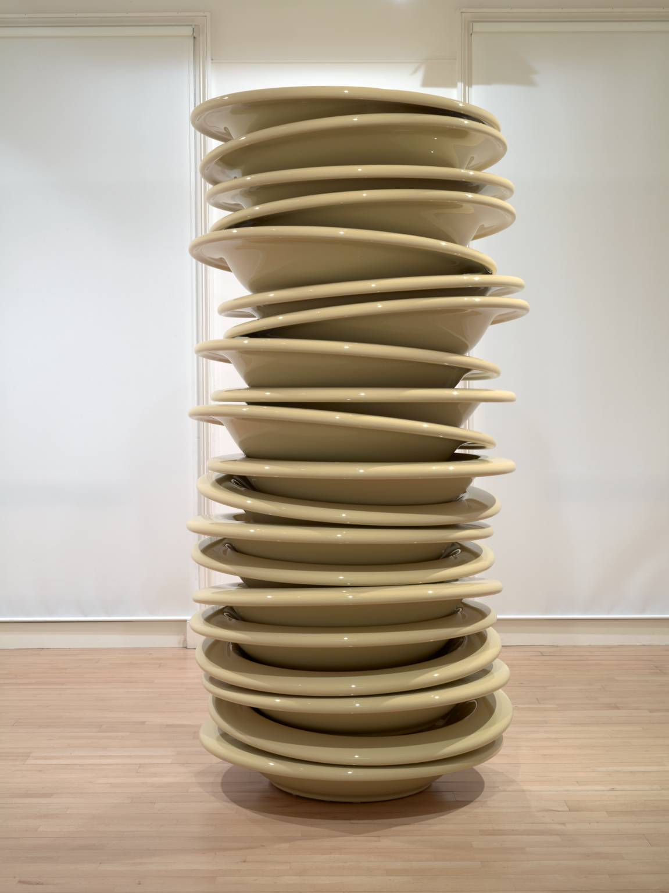
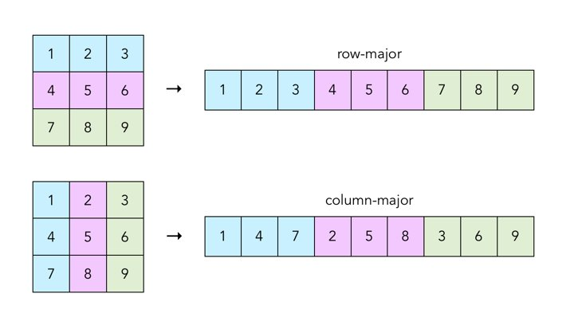
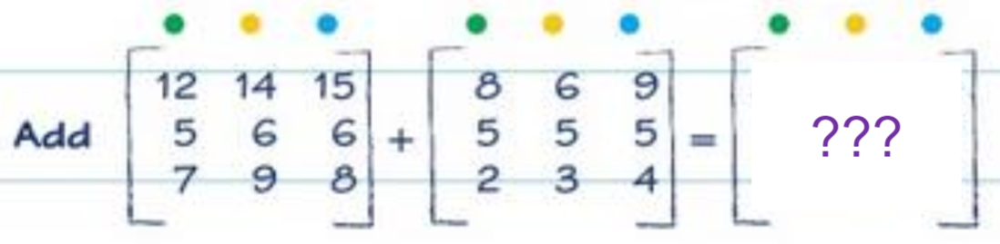
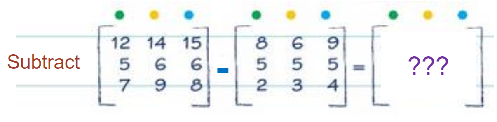
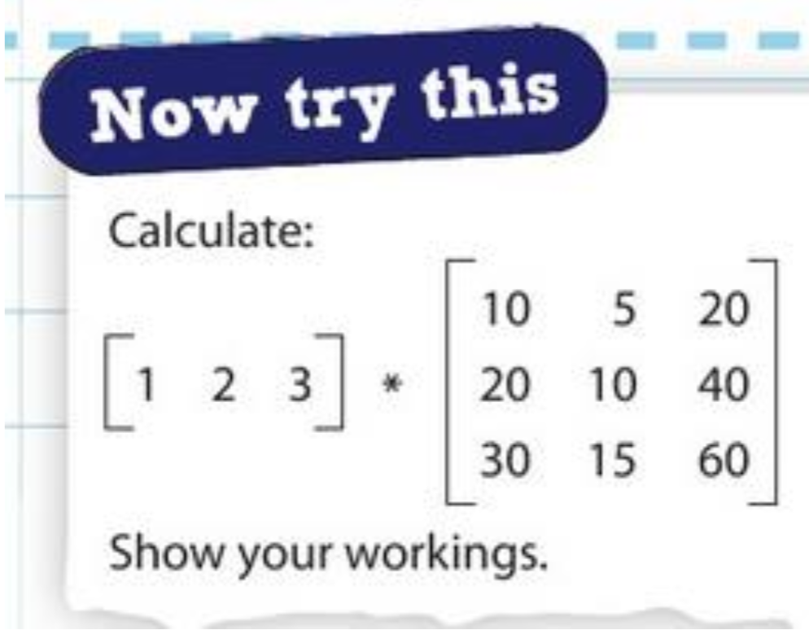
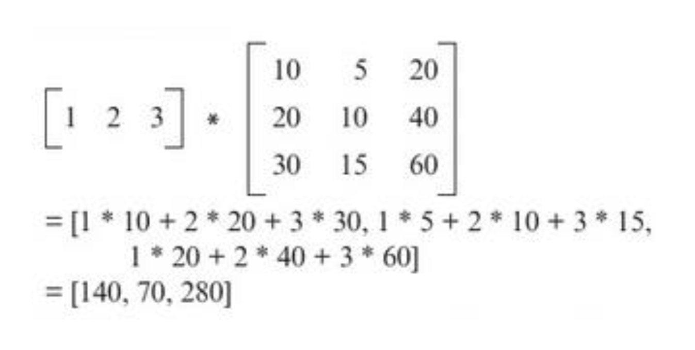

<p align="center">
  
</p>

# Organisation of data <!-- omit in toc -->

## Contents <!-- omit in toc -->

- [Static and dynamic data structures](#static-and-dynamic-data-structures)
  - [Static](#static)
- [Dynamic](#dynamic)
- [Stacks](#stacks)
  - [Push and pop excercise](#push-and-pop-excercise)
    - [Answers](#answers)
  - [What are stacks actually used for?](#what-are-stacks-actually-used-for)
- [Queues](#queues)
  - [Questions](#questions)
    - [Answers](#answers-1)
  - [Where are queues actually used?](#where-are-queues-actually-used)
- [Matrices](#matrices)
  - [Accessing data in matrices](#accessing-data-in-matrices)
  - [Matrix as 2D array example](#matrix-as-2d-array-example)
  - [Storing matrices - column-major and row-major](#storing-matrices---column-major-and-row-major)
  - [Matrix mathematics](#matrix-mathematics)
    - [Addition](#addition)
      - [Answer](#answer)
    - [Subtraction](#subtraction)
      - [Answer](#answer-1)
    - [Multiplication](#multiplication)
      - [Question](#question)


## Static and dynamic data structures

This isn't explicitly on the spec, but it's great to know anyway.

When you store data in memory, you need to decide if it's static or dynamic.

### Static

An example of static data would be an array.

When you create an array, you tell the compiler how big you want it to be. When the program is executed, it will reserve enough memory for the size you've specified. It never expands or shrinks.

You cannot change the amount of memory reserved for the array while being run.

Static data types can cause issues:

- if you end up trying to save/read from higher memory addresses than you've reserved, the program will crash
- if you reserve too much memory, you're being wasteful

## Dynamic

Dynamic variables don't have a fixed size in memory. An example of this is linked lists.

With linked lists, each item has a pointer to the memory address where the next item in the list can be found.

When you add more items to the list, more memory is allocated. Dynamic data is much easier to work with because of this.

Queues and stacks are examples of dynamic data structures, which we will learn about later in this document.

## Stacks

Stacks work on the "last in, first out" system (LIFO): the last item to be put into a stack is the first item to be popped out.

With a stack, you can **only** access the first item (at the top). Think about a stack of plates: you wouldn't take a plate from the middle of a stack, you'd take it from the top.

Adding an item to a stack is called **pushing** it onto the stack. Removing an item from a stack is called **popping**.

Stacks are allocated memory dynamically: the grow and shrink as needed.

> 
>
> A stack of plates!

_Please remember that the idea of a "stack" of items on top of each other is a way for humans to think of it. It's not stored like this in memory, but is instead programmed to behave like this._

### Push and pop excercise

**Create a stack capable of holding 6 integers.**

1. Push 5, push 3, push 4, pop, push 2, pop, pop, push 1
2. Push 1, push 2, push 3, push 4, push 5, pop, pop, pop, pop, pop
3. Push 7, push 3, pop, pop, push 1, pop, push 7, push 8, push 9, push 11, push 12, push 8, pop

#### Answers

1. `1`
2. None - it's empty
3. `12`

**Cheeky trick** - you don't need to look at the whole stack. Instead, you can work your way backwards. For 1, it ends with a push of `1`, so you can be sure `1` will be at the top of the stack.

For 2, you can count the pops going backwards, then ignore that amount of pushes. There are 5 pops, so we ignore 5 pushes. We're left with nothing.

For 3, we pop once, so we go backwards and ignore the first push, so we finish with the 2nd to last push, which is `12`.

### What are stacks actually used for?

A great example of where stacks are used is during interrupts. Before an Interrupt Service Routine (ISR) is run, the CPU will **push** the values from all the CPU registers into a stack. Once this ISR is complete, the values are **popped** off to continue execution where it left off.

Another place that stacks are used is programming. When you call a function, the address you were running instructions is pushed onto a stack so that the program knows where to continue execution when the called function finishes.

## Queues

Queues work via a "first-in first-out" (FIFO) or "last-in last-out" (LILO) system: the first item added will be the first item removed.

We use the same words **push** and **pop** to describe the adding and removing of data, but we also use **enqueue** and **dequeue**.

Both the front (head) and end (tail) of the queue is visible at all times.

Queues are also dynamic: they grow and shrink in size as items are added and removed.

### Questions

Set up a queue which holds 5 integers. What values are left in the queue and what are the items that have been removed.

1. E5, E7, E10, D, D, E1, D
2. E1, E2, E3, E4, E5, D, D, D, D, D
3. E3, E8, E9, D, E7, E2, E12, E1, D

#### Answers

1. In queue: `1`. Removed: `5`, `7`, `10`
2. In queue: none. Removed: `1`, `2`, `3`, `4`, `5`
3. In queue: `9`, `7`, `2`, `12`. Removed: `3`, `ERROR: FULL`, `8`

### Where are queues actually used?

Printers! When we queue something for printing, jobs are completed in the order they are sent. Otherwise it would be a little unfair to the poor person waiting for their print job.

Media streaming. When you watch video, the stream is played in the order the chunks are received. You wouldn't want it skipping ahead, then playing backwards.

## Matrices

A **matrix** is a mathematical construct for a table of numbers, usually represented as an array in computing. In computing, we store matrices as 2D arrays.

A matrix's size is represented by its **dimensions** (also known as its order). These dimensions are represented by RxC, where R is the number of rows and C is the number of columns.

> **Be warned!** You might be used to referring to dimensions as width x height. **Matrices are the opposite!**

```
1  7
5  3
2  8
```

This matrix would have the dimensions `3x2`.

### Accessing data in matrices

To access data in a matrix, we need to use two indices: one to show the row, and the other to show the column. These two indices then allow us to find the one item of data in that position.

The first index is the row number, and the second index is the column number. This is called row-major ordering as the row index comes first.

For example `[4, 2]` (zero-indexed) is the 5th row, and 3rd column.

### Matrix as 2D array example

|       |       |       |       |       |
| :---: | :---: | :---: | :---: | :---: |
|   4   |   2   |   1   |   3   |   5   |
|   7   |   9   |  10   |   7   |   8   |
|  14   |  13   |  15   |  11   |  12   |

1. `[0, 3]` - `3`
2. `[2, 2]` - `15`
3. `[1, 4] x [2, 1]` - `8 x 13` = `104`

### Storing matrices - column-major and row-major

There's two different ways to represent matrices: **row-major order** or **column-major order**.

In **row-major**, we store the matrix contents one by one, starting with the first row, moving between values from left to right, then to the next row. These values are stored next to each other in memory.

In **column-major**, we go down the columns first, and then move to the next row.

> 
>
> A diagram showing the difference between row-major and column-major ordering.

In an exam, you might be told an ordering method, and be given an array/matrix, and asked for the value at a certain index in memory.

### Matrix mathematics

You might be asked to perform different mathematical operations on matrices.

#### Addition



In this example, two matrices are being added together.

For addition, we simply layer the matrices on top of each other, and add the two values.

For example, to work out the top-left value, we add the top-left values from the source matrices: `12 + 8 = 20`.

##### Answer

```
20 20 24
10 11 11
 9 12 12
```

#### Subtraction



In this example, two matrices are being subtracted from one another.

For subtraction, we do the same as addition but we subtract values.

For example, the top top-right value in the answer will be `12 - 8 = 4`.

##### Answer

```
4  8  6
0  1  1
5  6  4
```

#### Multiplication


Matrix multiplication is challenging!

You can see these aren't the same size: that's fine. We first have to rotate the first matrix by 90 degrees.

```
2     12 14 15
3  x   5  6  6
4      7  9  8
```

We then look at the first column. We take the first item in the left matrix (`2`) and multiply it by the first item in the other matrix's first column (`12`). `2 x 12 = 24`.

After, we move to the next values down in both matrices: `3 x 5 = 15`.

We repeat this until the end of the column, where we then go to the top of the next column and start from the beginning.

After, we should be left with this:

```
2     12 14 15     24 28 30
3  x   5  6  6  =  15 18 18
4      7  9  8     28 36 32
```

Our final step is to total up the columns to finish with:

```
24 + 15 + 28 = 67
28 + 18 + 36 = 82
30 + 18 + 32 = 80
```

Which gives us a final answer of...

```
[ 67  82  80 ]
```

##### Question



<details>
<summary>Answer</summary>



</details>
