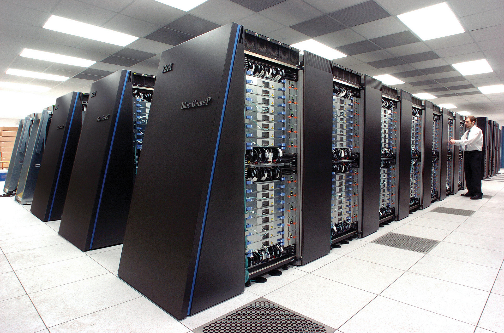

  

# Parallel processing <!-- omit in toc -->

## Contents <!-- omit in toc -->

- [What is parallel processing?](#what-is-parallel-processing)
- [Why do we need parallel processing?](#why-do-we-need-parallel-processing)
- [Method 1: Pipelining](#method-1-pipelining)
- [Method 2: multi-processing](#method-2-multi-processing)
  - [Multiple CPUs](#multiple-cpus)
- [Method 3: multi-threading](#method-3-multi-threading)
  - [Example: mobile app fetching from internet](#example-mobile-app-fetching-from-internet)
  - [Example: word processor](#example-word-processor)
  - [Example: browser](#example-browser)
- [Simultaneous multi-threading (SMT/Hyperthreading)](#simultaneous-multi-threading-smthyperthreading)

## What is parallel processing?

Parallel processing is where multiple CPUs or CPU cores work on small parts of a larger task, or appear to.

Breaking up an overall task into multiple smaller tasks often allows it task to finish quicker, improving efficiency.

Parallel processing is common in large supercomputers.

> 
>
> _The massively parallel IBM Blue Gene/P supercomputer._

## Why do we need parallel processing?

CPU clock speeds used to increase significantly every year as technology allowed transistors to be made smaller and smaller.

Faster clock speeds mean:

- the CPU executes more instructions per second
- more tasks can be completed in the same amount of time

CPUs have reached a point where making them run faster is very difficult. Instead, CPUs contain multiple processing cores, allowing them to complete many processes in parallel.

## Method 1: Pipelining

The CPU performs each stage of the Fetch-Decode-Execute cycle before the previous one has completed.

As the second instruction is being decoded, the first is being executes and the third is being fetched.

A common metaphor for pipelining is a manufacturing line. A factory doesn't build one car at a time, instead they build multiple cars in small stages (as one is getting its doors installed, another is having its interior fitted, another is being painted, etc).

This ends up turning the execution of 2 instructions from 8 clock cycles, down to 5. 3 instructions become 6 cycles instead of 12.

**Pipelining only works with RISC processors.** CISC instructions might take multiple clock cycles to execute.

**Pipelining only works in sequential execution.** If the task has a branch (i.e. goes to a different part of the code), the fetched and decoded instructions will be incorrect, as it didn't know the program was going to branch to a different set of instructions.

>  > _A diagram representing CPU pipelining._

## Method 2: multi-processing

Multi-processing uses multiple cores where...

- a single CPU has multiple processing units (cores)
- and the cores can independently process instructions

In theory, a dual-core processor can process instructions twice as fast as a single-core processor could, but many tasks aren't designed for parallel (asynchronous) execution, so aren't optimised for multiple cores.

Having multiple cores still allows for faster execution, as two different programs can run on the two cores.

>  > _Diagram showing how multiple cores can be used in parallel._

### Multiple CPUs

Some workstations, servers, and mainframes may have multiple CPUs in addition to multiple cores.

If we had a dual-CPU quad-core system, there would be 8 cores in total, allowing for 8 instructions to be executed in parallel, in the program is capable of this.

## Method 3: multi-threading

Allows multiple tasks of one process to be executed seemingly at the same time. Each task executes in a separate **thread**, while sharing the CPU resources.

Almost all modern CPUs support multi-threading.

The CPU, while processing instructions, will often have to wait while data is retrieved from memory or elsewhere. After the data is retrieved, the CPU switches back to the first task.

The CPU can switch to another task in another thread while data is fetched from the first task. The thread execution gives the illusion of concurrent execution.

### Example: mobile app fetching from internet

When you open a mobile app that requires data from the internet, you might see a loading spinner while the data is being fetched.

There are two threads in this example: the internet data fetcher, and the spinner renderer.

While the CPU is waiting for the data, it works on the spinner thread. When the data returns, the spinner will stop and another thread will build the GUI with the data returned.

### Example: word processor

Word needs multiple threads: one to respond to keystrokes, another to run the spelling and grammar checker, another to update the GUI, another to load any external images in the document.

All of these threads are executed extremely quickly, meaning you won't see them.

### Example: browser

Browsers often split up each browser tab into separate threads or processes.

Each tab will then need threads to...

- parse the stylesheet
- render the DOM
- paint the DOM
- execute Javascript
- fetch external content (images)
- update its own UI (address bar)

## Simultaneous multi-threading (SMT/Hyperthreading)

Cores are split into multiple virual cores. This allows for parallel processing on a single core.
